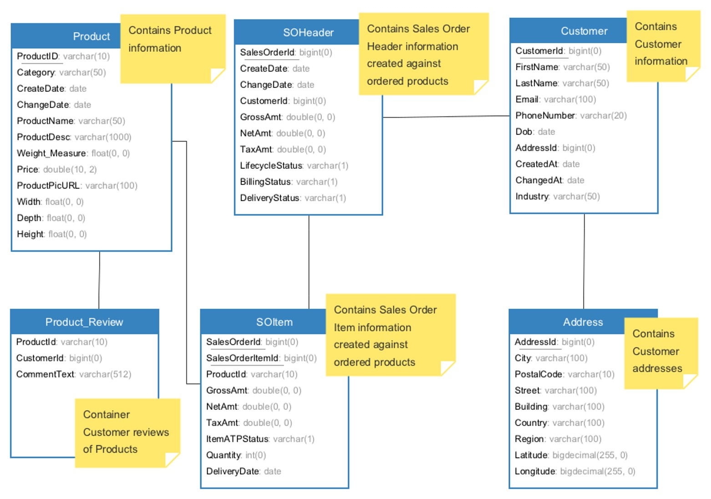

DINE
============
Data Hub INteractive Education(DINE) is a training content for Sap Data Hub. Our hands-on exercises are developed to show you how to use Sap Data Hub features. 
Sap Data Hub allows you to connect to different data sources such as SAP Hana, SAP ERP, SAP BW, Oracle DB2, SQL Server, and many more and can process various data types; structured, semi-structured and unstructured using Kafka, streaming engine, text and image analysis, etc. SAP Data Hub can bring all your data together so you can work across them seamlessly. You can quickly develop your prototype on Data Hub and the result can be easily turned to a production level system since Data Hub takes care of execution, orchestrain, scheduling, and monitoring. Data Hub is developed on Kubernetes and therefore it is deployable on premise or in the cloud. It runs on a distributed execution engine and is designed for Big Data world by proving understanding on metadata in a Big Data landscape. 

Click here(https://www.sap.com/products/data-hub.html) to learn more about SAP Data Hub.

Click here(https://help.sap.com/viewer/p/SAP_DATA_HUB) to access the official documentation. 

## Overview

DINE makes it easy to learn how to build pipelines in SAP Data Hub using its operators . It acts as reference for application developers and showcases the features of Data Hub in an easy to understand business scenario. This demo content comes complete with:  
- Sample data
- Code snippets
- Tutorials

## Prerequisites

SAP Data Hub Setup - Follow the [Installation Guide for SAP Data Hub](https://help.sap.com/viewer/e66c399612e84a83a8abe97c0eeb443a/2.4.latest/en-US/9f866d8ef9a94c30947f12e73eaf0dd9.html) and setup your SAP Data Hub environment.

You can also use SAP Data Hub Developer Edition. Read more here: https://blogs.sap.com/2017/12/06/sap-data-hub-developer-edition/
or SAP Data Hub Trial Edition. Read more here: https://blogs.sap.com/2018/04/26/sap-data-hub-trial-edition/

## Datasets

Currently our dataset comprises of 6 files, which contain <b>customers</b>, <b>products</b> and <b>sales</b> information.
	
- <b>CUSTOMER</b> table has details  of  customers , this table has <b>ADDRESSID</b> which is mapped to <b>ADDRESS</b> table where details of customers address are stored.
		
- When a Customer buys a Product, Sales Order is generated (<b>SO_HEADER</b>) and each sales order has multiple order items (<b>SO_ITEM</b>).

- <b>SO_HEADER</b> has <b>PARTNERID</b> , a foreign key which links to <b>CUSTOMER</b> table.

- <b>SO_ITEM</b> has SALESORDERID, a foreign key which links to <b>SO_HEADER</b>.

- Each <b>SO_ITEM</b> will have <b>PRODUCTID</b> which is mapped to <b>PRODUCT</b> table where details of products are stored.

- Customer Reviews about the products are stored in <b>REVIEW</b> table.

- So basically we have 6 tables.

- It is sythetic dataset based on real time usecases which we have taken from [SHINE](https://github.com/SAP/hana-shine-xsa) and we have enriched some of the data according to our needs.

### ER Diagram

To access the datasets, explore the [data](./data) folder in this repository.

## Scenarios

To learn Sap Data Hub, we will create a recommender system for Data Hub Market Place, an e-commerce platform which is developed for the purpose of demo and learning, where customers across the globe make thousands of purchases everyday. 

 - [Sentiment Analyser](./tutorials/top%205%20products%20based%20on%20products%20reviews/README.md) : To build a pipeline which uses VORA text analysis engine to find the 5 most popular products based on customer reviews. Products are categorised based on the sentiment of their reviews. Python was used to implement this scenario.

 - [Product Recommender](./tutorials/product%20recommendations%20using%20fp%20growth%20algorithm/README.md) : To build a pipeline which uses Machine Learning (ML) to recommend products based on the history of sales transactions. We use python as the programming language for Machine Learning Capabilities.

 
