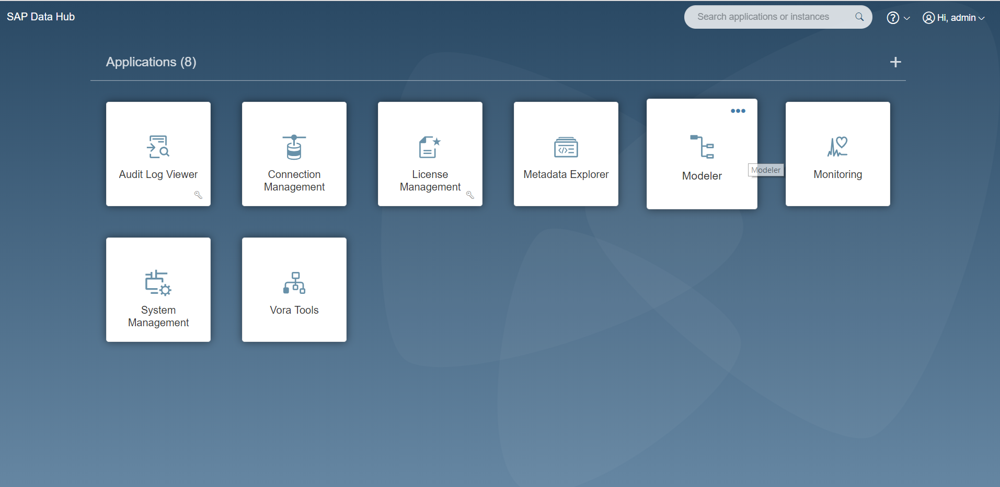
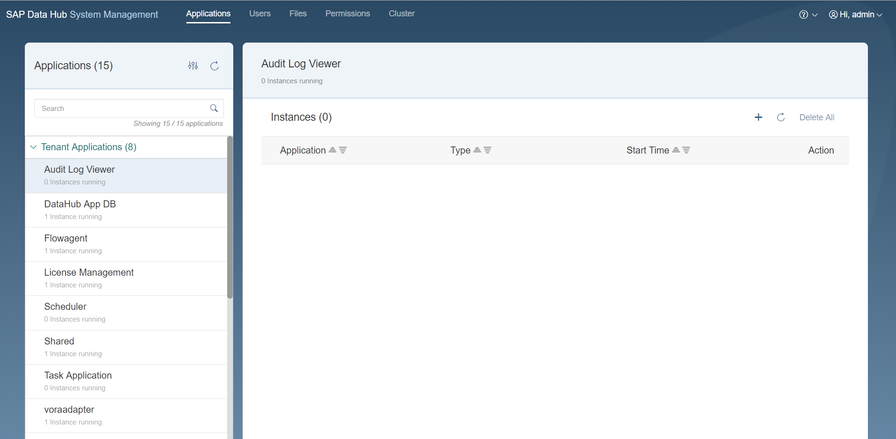
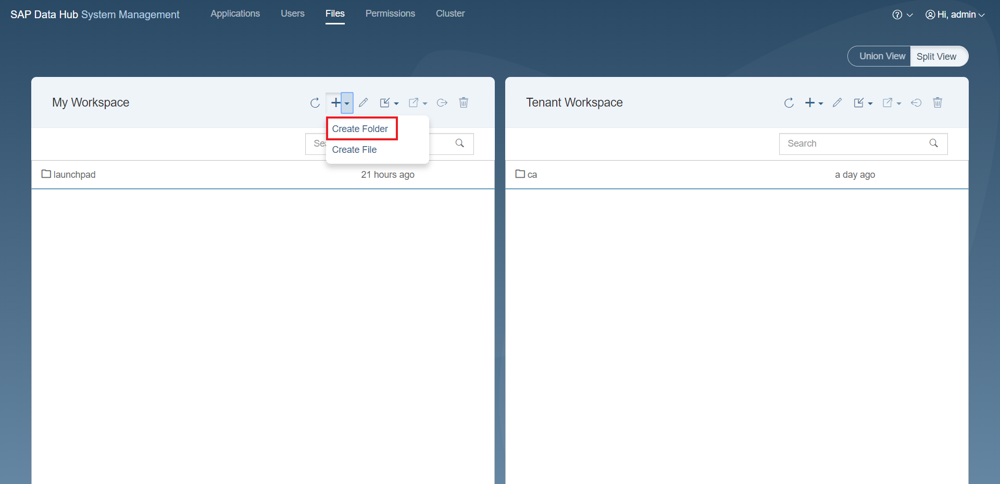
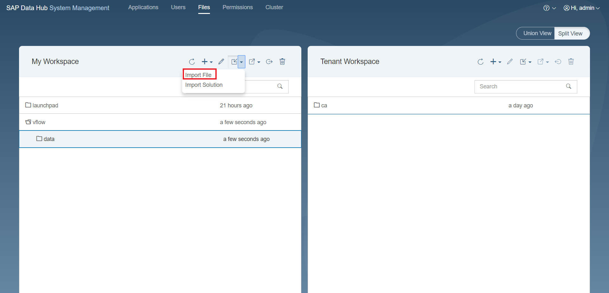
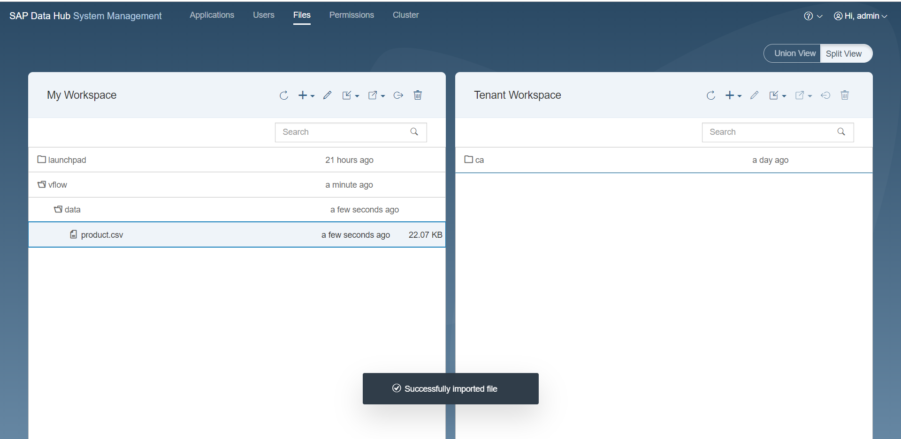

Loading of Data
====================

> <b><i> Download the data files from [here](https://github.com/SAP/datahub-dine/tree/master/data) </i></b>

1. Open the Data Hub dashboard and open the System Management application

  
  
  
2. System Management welcome page Will look something like this

    
  
  
3. Go to Files section and click on '+' and choose 'create folder' 

    
  
  
4. Name the folder as 'vflow/data'  

    
  
  
5. Click on "data" and choose 'import file' option  

  
  
  
6. Choose the file you want to upload  

   
  
  
7. Repeat the steps 6 & 7 for all files.  
