## Product recommendations using FP Growth Algorithm

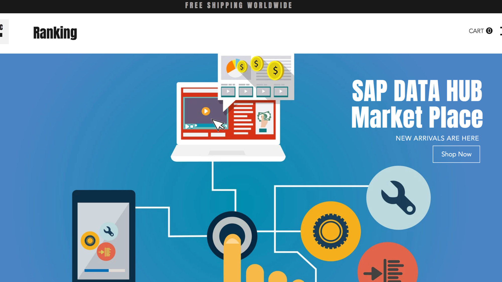

> <b><i> Load the data required for the scenario by following this [tutorial](https://github.wdf.sap.corp/refapps/datahub-dine/blob/master/tutorials/loading%20of%20data/README.md) </i> </b>

1. Open the Data Hub dashboard and open the modeler.

  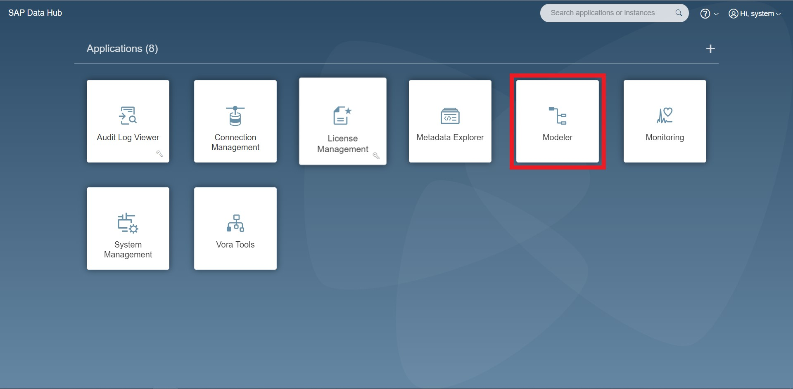

2. Modeler welcome page Will look something like this.

  

3. Create a new graph by clicking on the "+" sign on the top.

  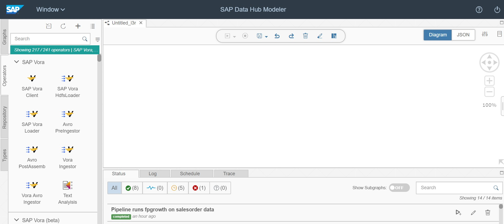

4. Search for the read file operator in the operator's section.

  

5. Drag and drop "Read File" into the graph.

  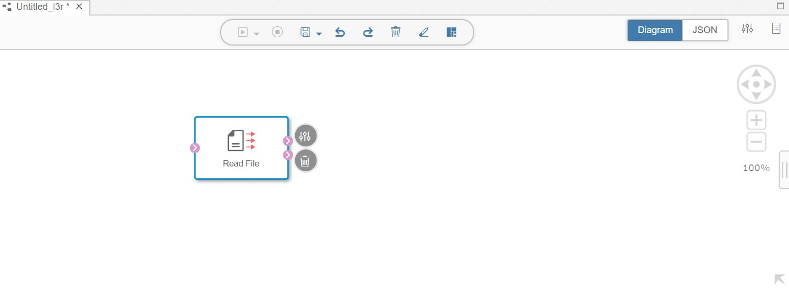

6. Click on “Open Configuration” and provide the following properties.

    <b>Service: file</b>
    
    <b>Path: data/product.csv</b>
    
    <b>Only read on change: true</b>

    Let the other properties remains the same.
    
  
    
    
7. Again Drag and drop “Read File” into the graph.

  

8. Click on “Open Configuration” and provide the following properties.

  <b>Service: file</b>
  
  <b>Path: data/soItem.csv</b>
  
  <b>Only read on change: true</b>
  
  Let the other properties remains the same.

  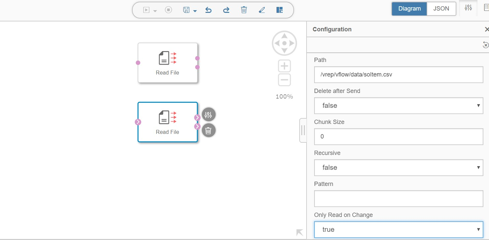

9. Now we need to install required python libraries to run FPGrowth algorithm. To do that, select the Repository tab. Expand Docker File and create a folder named as “python library” under that.

  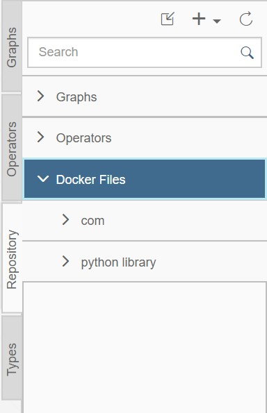

10. Right click on “python Libraries” and select “Create Docker File”.

  

11. A create Docker window will pop up. Name it as “RecommenderLibraries”. Click on OK.

  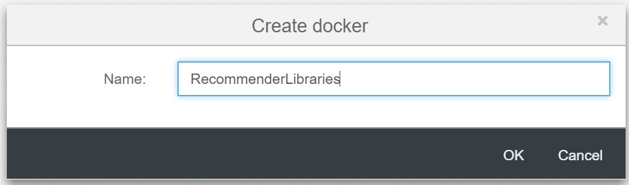

12. Copy the commands from this [file](./dockerfile ) and paste it in the script section.

  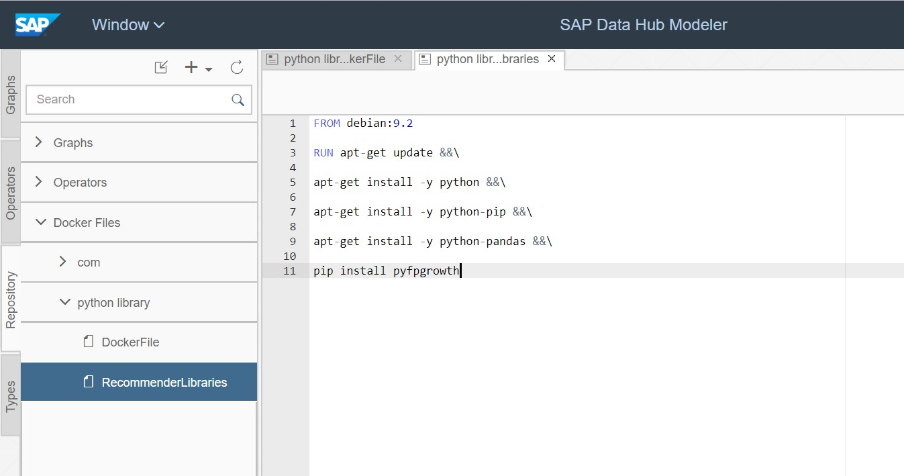

13. Select the configuration for this docker file. Click on the “+” icon on the right side of Tags and add the following tags to the configuration by simply entering the library’s name and press enter.

-	pyfpgrowth
-	pandas
-	python27

  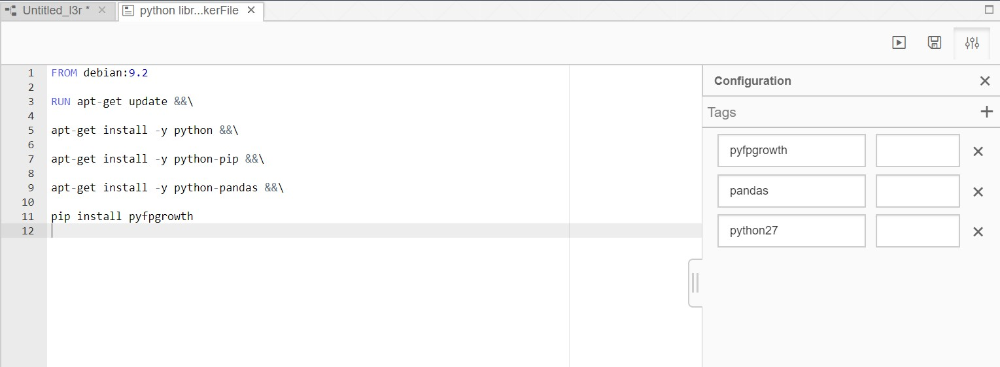

14. Save the file and build this docker file by clicking build button.  Once completed it will show you the build status as completed, and orange circle will turn to green.

  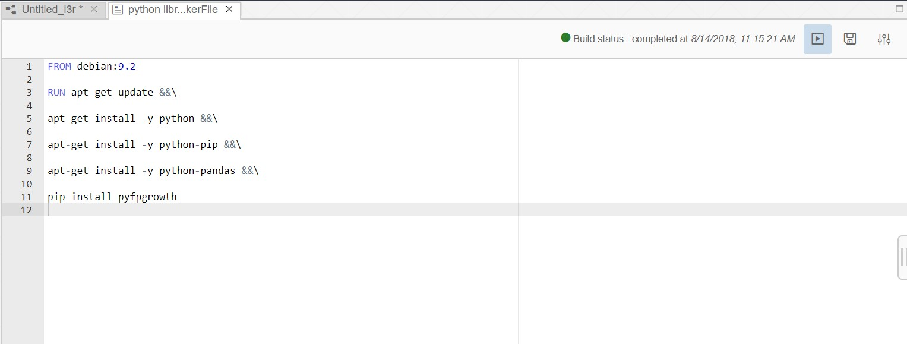

15. Again, go back to the graph and search for the python2operator in the operators section.

  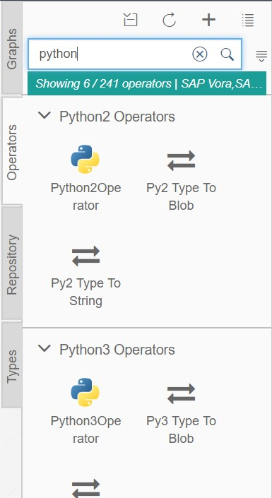

16. Drag and drop this operator in the graph.

  

17. Now let’s add 2 input ports and 1 output port to the python operator. Select the python operator and click on “add port”.

  

18. Give the following properties for input port and then click OK.

  Similarly add one more input port and called it “input2”

  

  

19. Similarly add the output port.

  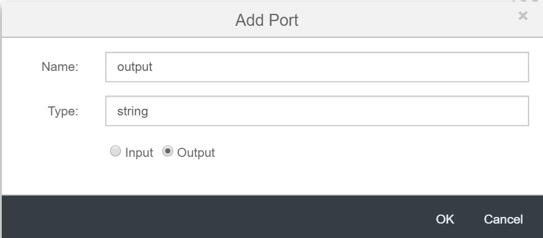

20. Join “Read File 1” operator to “input1” port of “python2operator” and
“Read File 2” operator to “input2” port of “python2operator” as shows in the figure below.

  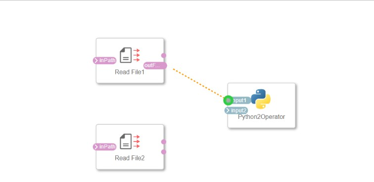

21. Select the ToString Convertor if prompted and then click OK.

  

22. The graph will look like below.

  

23. Now select the python operator. It will show you all the available option with this operator, then choose open script option.

  

24. A new page will open where you can write python code. Copy the [code](./code%20snippets/FPGrowthAlgorithm.py) from here and paste it.

  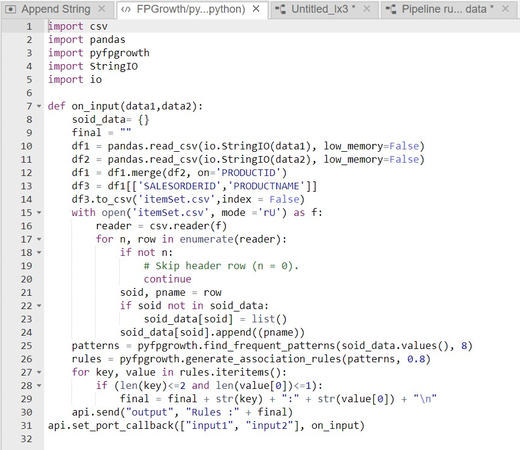
  
  Go back to the graph

25. Now next thing is to tell the graph where we can find the python libraries that we installed. For that right click on python operator and select “Group”.

  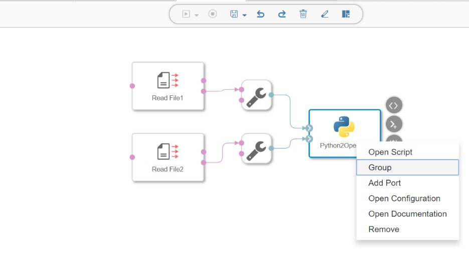

26. Select the entire group and open the configuration for that.

  

27. Next step is to add tags. Tags describe the runtime requirements of the operator and force the execution in a specific Docker image instance whose Docker file was annotated with the same Tag and Version.

28. Click on “+” button to add tags as below.
pyfpgrowth
pandas
python27

  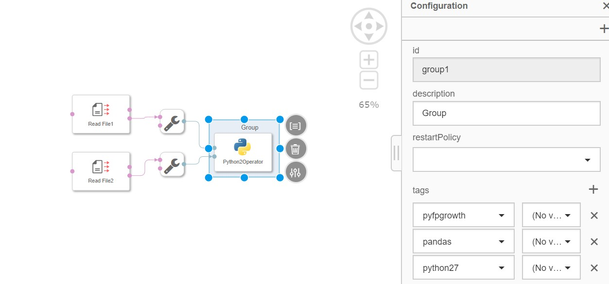

29. Next step is to see the output on the terminal. For that search Terminal operator and add it to the graph.

  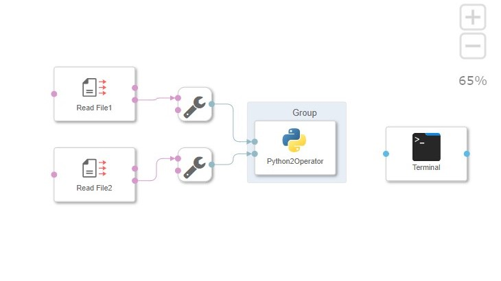

30. Connect output port of the “Python2Operator” to input port of the Terminal

  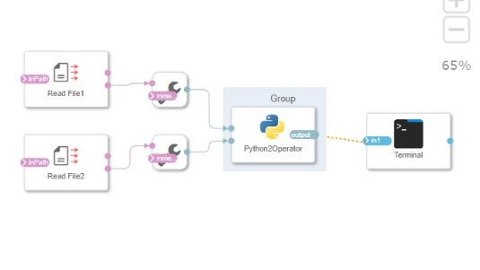

31. Save the pipeline and call it as “Recommender”.

  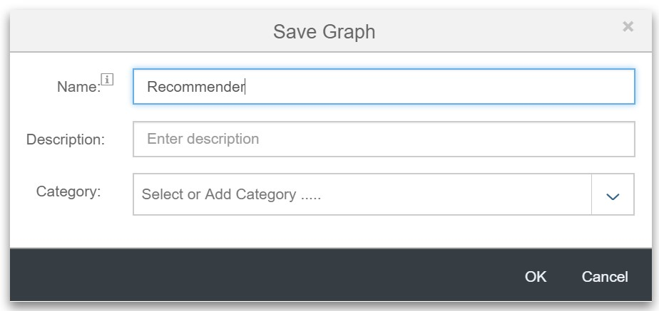

32. Click on run to run the pipeline.

  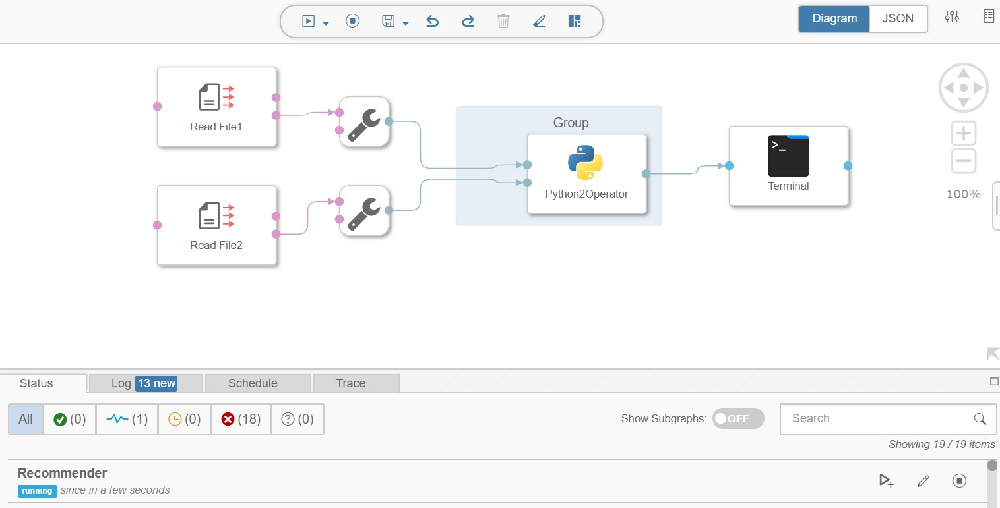

33. See the output as below

  
  
  

